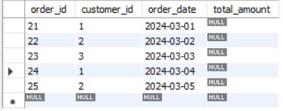
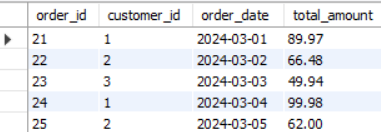
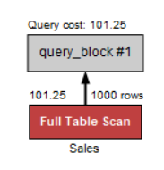
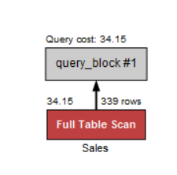

# OLA3_DB

## Part 1 Optimistic & Pessimistic Concurrency Control

### DATABASE CREATION SCRIPT

```sql
CREATE DATABASE  IF NOT EXISTS `esport`;
USE `esport`;

-- tables

DROP TABLE IF EXISTS `players`;
CREATE TABLE `players` (
  `player_id` int NOT NULL AUTO_INCREMENT,
  `username` varchar(45) NOT NULL,
  `email` varchar(45) NOT NULL,
  `ranking` int DEFAULT '0',
  `created_at` datetime DEFAULT NULL,
  PRIMARY KEY (`player_id`),
  UNIQUE KEY `username_UNIQUE` (`username`),
  UNIQUE KEY `email_UNIQUE` (`email`)
) ENGINE=InnoDB AUTO_INCREMENT=1 DEFAULT CHARSET=utf8mb4 COLLATE=utf8mb4_0900_ai_ci;

DROP TABLE IF EXISTS `tournaments`;
CREATE TABLE `tournaments` (
  `tournament_id` int NOT NULL AUTO_INCREMENT,
  `name` varchar(45) NOT NULL,
  `game` varchar(45) NOT NULL,
  `max_players` int NOT NULL,
  `start_date` datetime NOT NULL,
  `created_at` datetime NOT NULL,
  PRIMARY KEY (`tournament_id`)
) ENGINE=InnoDB AUTO_INCREMENT=1 DEFAULT CHARSET=utf8mb4 COLLATE=utf8mb4_0900_ai_ci;

DROP TABLE IF EXISTS `matches`;
CREATE TABLE `matches` (
  `match_id` int NOT NULL AUTO_INCREMENT,
  `tournament_id` int NOT NULL,
  `player1_id` int NOT NULL,
  `player2_id` int NOT NULL,
  `winner_id` int DEFAULT NULL,
  `match_date` datetime DEFAULT NULL,
  PRIMARY KEY (`match_id`),
  KEY `tournament_id_idx` (`tournament_id`),
  KEY `player_id_idx` (`player1_id`),
  KEY `player2_id_idx` (`player2_id`),
  KEY `winnder_id_idx` (`winner_id`),
  CONSTRAINT `match_tournament_id` FOREIGN KEY (`tournament_id`) REFERENCES `tournaments` (`tournament_id`),
  CONSTRAINT `player1_id` FOREIGN KEY (`player1_id`) REFERENCES `players` (`player_id`),
  CONSTRAINT `player2_id` FOREIGN KEY (`player2_id`) REFERENCES `players` (`player_id`),
  CONSTRAINT `winnder_id` FOREIGN KEY (`winner_id`) REFERENCES `players` (`player_id`)
) ENGINE=InnoDB DEFAULT CHARSET=utf8mb4 COLLATE=utf8mb4_0900_ai_ci AUTO_INCREMENT=1;


DROP TABLE IF EXISTS `tournament_registrations`;
CREATE TABLE `tournament_registrations` (
  `registration_id` int NOT NULL AUTO_INCREMENT,
  `registered_at` datetime NOT NULL,
  `tournament_id` int NOT NULL,
  `player_id` int NOT NULL,
  PRIMARY KEY (`registration_id`),
  KEY `tournament_id_idx` (`tournament_id`),
  KEY `player_id_idx` (`player_id`),
  CONSTRAINT `player_id` FOREIGN KEY (`player_id`) REFERENCES `players` (`player_id`),
  CONSTRAINT `tournament_id` FOREIGN KEY (`tournament_id`) REFERENCES `tournaments` (`tournament_id`)
) ENGINE=InnoDB DEFAULT CHARSET=utf8mb4 COLLATE=utf8mb4_0900_ai_ci AUTO_INCREMENT=1;

-- triggers:

DELIMITER $$

CREATE TRIGGER set_created_at
BEFORE INSERT ON players
FOR EACH ROW
BEGIN
    IF NEW.created_at IS NULL THEN
		SET NEW.created_at = NOW();
	END IF;
END $$

DELIMITER ;

DELIMITER $$

CREATE TRIGGER set_created_at_tournaments
BEFORE INSERT ON tournaments
FOR EACH ROW
BEGIN
    IF NEW.created_at IS NULL THEN
		SET NEW.created_at = NOW();
	END IF;
END $$

DELIMITER ;

DELIMITER //
create trigger beforeInsertRegistration
before insert on tournament_registrations
for each row
begin
	declare playerCount int;
    declare maxPlayers int;

    select count(*) into playerCount from tournament_registrations where tournament_id = NEW.tournament_id;
    select max_players into maxPlayers from tournaments where tournament_id = NEW.tournament_id;

    IF playerCount>= maxPlayers then
		signal sqlstate '45000' set message_text = 'Tournament Full';

    end if;

end //

DELIMITER ;

DELIMITER //
create trigger afterInsertMatch
after update on matches
for each row
begin

    DECLARE player1_ranking INT;
    DECLARE player2_ranking INT;

    SELECT RANKING INTO player1_ranking FROM players WHERE player_id = new.player1_id;
    SELECT RANKING INTO player2_ranking FROM players WHERE player_id = new.player2_id;

    if new.winner_id = new.player1_id then
		update players set ranking = ranking + 10 where player_id = new.player1_id;
        if player2_ranking >= 10 then
			update players set ranking = ranking - 10 where player_id = new.player2_id;
		else
			update players set ranking = 0 where player_id = new.player2_id;
		end if;
	elseif new.winner_id = new.player2_id then
		update players set ranking = ranking + 10 where player_id = new.player2_id;
        if player1_ranking >= 10 then
			update players set ranking = ranking - 10 where player_id = new.player1_id;
		else
			update players set ranking = 0 where player_id = new.player1_id;
		end if;
    end if;
end //

DELIMITER ;

-- procedures

DELIMITER //

CREATE PROCEDURE joinTournament(
    IN p_player_id INT,
    IN p_tournament_id INT
)
BEGIN
    IF EXISTS (
		SELECT 1
        FROM tournament_registrations
        WHERE tournament_id = p_tournament_id
        AND player_id = p_player_id
    )THEN
		signal sqlstate '45000' set message_text = 'Player has already registered to that tournament.';
    ELSE
        insert into tournament_registrations (player_id, tournament_id, registered_at)
        values (p_player_id, p_tournament_id, NOW());
    END IF;
END //

DELIMITER ;

DELIMITER //

CREATE PROCEDURE registerPlayer(
    IN p_username VARCHAR(45),
    IN p_email VARCHAR(45),
    IN p_ranking INT(10)
)
BEGIN
    INSERT INTO players (username, email, ranking, created_at)
    VALUES (p_username, p_email, p_ranking, NOW());
END //

DELIMITER ;

DELIMITER //

CREATE PROCEDURE submitMatchResult(
    IN p_match_id INT,
    IN p_winner_id INT
)
BEGIN

	DECLARE p_player1_id INT;
    DECLARE p_player2_id INT;

    SELECT player1_id, player2_id
    INTO p_player1_id, p_player2_id
    FROM matches
    WHERE match_id = p_match_id;

    IF p_winner_id = p_player1_id or p_winner_id = p_player2_id THEN
        UPDATE matches
        SET winner_id = p_winner_id
        WHERE match_id = p_match_id;

        if p_winner_id = p_player1_id then
			update players set ranking = ranking + 10 where player_id = p_player1_id;
			update players set ranking = ranking - 10 where player_id = p_player2_id;
		elseif p_winner_id = p_player2_id then
			update players set ranking = ranking + 10 where player_id = p_player2_id;
			update players set ranking = ranking - 10 where player_id = p_player1_id;
		end if;
    ELSE
        signal sqlstate '45000' set message_text = 'Winner is not a participant of this match.';
    END IF;

END

DELIMITER ;

-- functions:

DELIMITER //
create function getTotalWins(playerID int) returns int
deterministic
begin
    declare totalWins int;

    select COUNT(*) into totalWins
    from matches
    where winner_id = playerID;

    return totalWins;
end //
DELIMITER ;

DELIMITER //
create function getTournamentStatus(tournamentID INT) RETURNS VARCHAR(20)
DETERMINISTIC
begin
    declare tournamentStart date;
    declare tournamentEnd date;
    DECLARE status VARCHAR(20);

    -- Get tournament start date
    SELECT start_date INTO tournamentStart FROM tournaments WHERE tournament_id = tournamentID;

    -- If no matches have been played, it's "upcoming"
    IF tournamentStart > CURDATE() THEN
        SET status = 'upcoming';
    -- If there are matches but no winner for all matches, it's "ongoing"
    ELSEIF EXISTS (SELECT 1 FROM matches WHERE tournament_id = tournamentID AND winner_id IS NULL) THEN
        SET status = 'ongoing';
    ELSE
        SET status = 'completed';
    END IF;

    RETURN status;
END //
DELIMITER ;

-- Test data:

INSERT INTO esport.players(username, email, ranking)
VALUES
('maverick', 'm@test.dk', 0),
('gobsmacked', 'g@test.dk', 100),
('flume', 'f@test.dk', 200),
('ranivorous', 'r@test.dk', 150),
('phalange', 'p@test.dk', 2000),
('sprout','s@test.dk', 175),
('bulbous', 'b@test.dk', 50),
('drizzle', 'd@test.dk', 0),
('wharf', 'w@test.dk', 80),
('Jackster', 'j@test.dk', 1250);

INSERT INTO esport.tournaments(name, game, max_players, start_date)
VALUES
('Free Fire', 'CS', 100, '2025-03-10 12:00:00'),
('COBX Masters', 'LOL', 325, '2025-06-20 20:00:00'),
('PUBG Championships', 'PUBG', 120, '2025-04-15 08:00:00'),
('Cybergamer', 'DOTA', 50,'2026-04-09 15:00:00'),
('Evolution Championships','CS', 80,'2026-01-01 08:00:00'),
('Hero Pro League', 'HON', 30, '2024-12-24 18:00:00'),
('League Gaming', 'LOL', 50, '2024-11-06 14:00:00');

INSERT esport.tournament_registrations(registered_at, tournament_id, player_id)
VALUES
('2024-11-05 14:00:00', 7, 1),
('2024-11-04 14:00:00', 7, 2),
('2025-03-02 12:00:00', 1, 1),
('2025-03-02 12:00:00', 2, 1),
('2025-03-02 12:00:00', 4, 7),
('2025-03-02 12:00:00', 4, 10),
('2025-03-02 12:00:00', 1, 7),
('2025-03-02 12:00:00', 1, 8),
('2025-03-02 12:00:00', 2, 9),
('2025-03-02 12:00:00', 3, 2),
('2025-03-02 12:00:00', 1, 6),
('2025-03-02 12:00:00', 1, 5),
('2025-03-02 12:00:00', 4, 1);

INSERT INTO esport.matches(tournament_id, player1_id, player2_id, match_date, winner_id)
VALUES
(7, 1, 2, '2024-11-06 14:00:00', 1),
(1, 1, 7, '2025-03-10 13:00:00', null),
(1, 1, 8, '2025-03-10 12:00:00', null),
(1, 7, 8, '2025-03-10 14:00:00', null);

```

### 1.0 Implement Optimistic Concurrency Control for Tournament Updates

```java
    public static boolean changeStartDateTournament (int tournamentId, String newStartDate) throws Exception {
        try (Connection conn = DriverManager.getConnection(URL, USER, PASSWORD)) {
            conn.setAutoCommit(false);

            // Read the version of the tournament
            String selectSQL = "SELECT start_date, version FROM tournaments WHERE tournament_id = ?";
            int currentVersion;

            try(PreparedStatement selectStmt = conn.prepareStatement(selectSQL)){
                selectStmt.setInt(1, tournamentId);
                ResultSet rs = selectStmt.executeQuery();

                if (!rs.next()) {
                    System.out.println("Tournament not found.");
                    return false;
                }
                currentVersion = rs.getInt("version");

            }

            String updateSQL = "UPDATE tournaments SET start_date = ?, version = version + 1 WHERE tournament_id = ? AND version = ?";
            try(PreparedStatement updateStmt = conn.prepareStatement(updateSQL)) {
                updateStmt.setString(1, newStartDate);
                updateStmt.setInt(2, tournamentId);
                updateStmt.setInt(3, currentVersion);

                int rowsAffected = updateStmt.executeUpdate();

                if (rowsAffected == 0) {
                    System.out.println("Optimistic locking failed. The tournament was modified by another transaction. Please try again.");
                    conn.rollback();
                    throw new Exception("Optimistic locking failed.");
                } else {
                    conn.commit();
                    System.out.println("Tournament start date changed successfully.");

                    return true;
                }
            }


        } catch (SQLException e) {
            System.err.println("Database error: " + e.getMessage());
            return false;
        }
    }
```

#### Tournament table:


### 2.0 Implement Pessimistic Concurrency Control for Match Updates

```java
    public static void updateMatchResult(int match_id, int winner_id) {
        try (Connection conn = DriverManager.getConnection(URL, USER, PASSWORD)){
             conn.setAutoCommit(false);
             String lockSQL = "SELECT * FROM matches WHERE match_id = ? FOR UPDATE";

             try(PreparedStatement lockStmt = conn.prepareStatement(lockSQL)){
                 lockStmt.setInt(1, match_id);
                 lockStmt.executeQuery();
             }

             String updateSQL = "UPDATE matches SET winner_id = ? WHERE match_id = ?";
             try (PreparedStatement updateStmt = conn.prepareStatement(updateSQL)){
                 updateStmt.setInt(1, winner_id);
                 updateStmt.setInt(2, match_id);
                 int rowsAffected = updateStmt.executeUpdate();

                 if (rowsAffected == 0){
                     System.out.println("Match result update failed.");
                     conn.rollback();
                 } else {
                     conn.commit();
                     System.out.println("Match result updated successfully.");
                 }
             }


        } catch (SQLException e) {
            System.err.println("Database error: " + e.getMessage());
        }
    }
```

### 3.0 Handle Transactions for Tournament Registrations

```java
    public static void handleTournamentRegistrations (int playerId, int tournamentId) {
        try(Connection conn = DriverManager.getConnection(URL, USER, PASSWORD)){
            try {
                conn.setAutoCommit(false);
                PreparedStatement lockstmt = conn.prepareStatement("SELECT * FROM players WHERE player_id = ? FOR UPDATE");
                lockstmt.setInt(1, playerId);
                lockstmt.execute();

                CallableStatement stmt = conn.prepareCall("{CALL joinTournament(?, ?)}");
                stmt.setInt(1, playerId);
                stmt.setInt(2, tournamentId);
                stmt.execute();
                PreparedStatement updateRanking = conn.prepareStatement("UPDATE players SET ranking = ranking + 10 WHERE player_id = ?");
                updateRanking.setInt(1, playerId);
                updateRanking.executeUpdate();


                conn.commit();
                System.out.println("Player " + playerId + " joined tournament " + tournamentId + " successfully.");

            } catch (SQLException e) {
                System.err.println("Database error when committing changes: " + e.getMessage());
                conn.rollback();
            }
        }
        catch (SQLException e) {
            System.err.println("Database error when creating a connection: " + e.getMessage());
        }

    }
```

#### TEST

DB state before test:

tournament_registrations table:


players table:


tournament table:


Test code:

```java
    public static void main(String[] args) {
        ConcurrencyControl.handleTournamentRegistrations(4, 1);
    }
```

Try to register player 4 to tournament 1. Which has a max player count of 6 and already 6 other players participating.

Expected result: Player 4 will not be registered and the update to his ranking will be rolled back.

results:


DB state after test:


### 4.0 Implement a Stored Procedure for Safe Ranking Updates

```java
public static void submitMatchResultV2 (int match_id, int winner_id) {
        try (Connection conn = DriverManager.getConnection(URL, USER, PASSWORD)) {
            try{
                CallableStatement stmt = conn.prepareCall("{CALL submitMatchResult2(?, ?)}");
                stmt.setInt(1, match_id);
                stmt.setInt(2, winner_id);
                stmt.execute();
                System.out.println("Match result submitted successfully.");
            }
            catch (SQLException e){
                System.out.println("Something went wrong when committing changes " + e.getMessage());
                throw new RuntimeException(e);
            }

        } catch (SQLException e) {
            System.err.println("Database error when creating a connection: " + e.getMessage());
        }
    }
```

```sql
CREATE DEFINER=`devtester`@`%` PROCEDURE `submitMatchResult2`(
    IN p_match_id INT,
    IN p_winner_id INT
)
BEGIN
	DECLARE p_player1_id INT;
    DECLARE p_player2_id INT;

    START TRANSACTION;

    SELECT player1_id, player2_id
    INTO p_player1_id, p_player2_id
    FROM matches
    WHERE match_id = p_match_id;

    IF p_winner_id = p_player1_id or p_winner_id = p_player2_id THEN
        UPDATE matches
        SET winner_id = p_winner_id
        WHERE match_id = p_match_id;

        if p_winner_id = p_player1_id then
			update players set ranking = ranking + 10 where player_id = p_player1_id;
			update players set ranking = ranking - 10 where player_id = p_player2_id;
		elseif p_winner_id = p_player2_id then
			update players set ranking = ranking + 10 where player_id = p_player2_id;
			update players set ranking = ranking - 10 where player_id = p_player1_id;
		end if;
    ELSE
        signal sqlstate '45000' set message_text = 'Winner is not a participant of this match.';
    END IF;

    COMMIT;

END
```

Test code:

```java
    public static void main(String[] args) {
        ConcurrencyControl.submitMatchResultV2Test(3,8);
    }

    public static void submitMatchResultV2Test (int match_id, int winner_id) {
        ExecutorService executor = Executors.newFixedThreadPool(2);
        for(int i = 0; i < 2; i++){
            executor.submit(() -> {
                submitMatchResultV2(match_id, winner_id);
            });
        }
        executor.shutdown();
    }
```

Det forsøges at simulere to samtidige forsøg på at opdatere en match. Det forventede resultat af testen vil være at matchens resultat bliver opdateret 2 gange, og derved får dobbelt ranking. Det skyldes at den pessimistiske metode sørger for at den query, som ikke kom først og derved låste, venter på at den anden query har gjort sit arbejde færdigt, før det gennemføres. Havde det været en rigtig business case, ville der til denne implementation skulle tilføjes sikring mod at den samme spiller ikke får ranking adskillelige gange ved opdatering af den samme match, men dette er der ikke taget højde for i denne implementation.

DB state før test players tabel:


Resultat:


DB state efter test:


Spillerens ranking blev opdateret to gange, da begge queries blev gennemført. Den stiger dog dobbelt op, da der ved tidligere lejlighed har været implementeret denen trigger, til at håndtere samme implementering:

```sql
DELIMITER //
create trigger afterInsertMatch
after update on matches
for each row
begin

    DECLARE player1_ranking INT;
    DECLARE player2_ranking INT;

    SELECT RANKING INTO player1_ranking FROM players WHERE player_id = new.player1_id;
    SELECT RANKING INTO player2_ranking FROM players WHERE player_id = new.player2_id;

    if new.winner_id = new.player1_id then
		update players set ranking = ranking + 10 where player_id = new.player1_id;
        if player2_ranking >= 10 then
			update players set ranking = ranking - 10 where player_id = new.player2_id;
		else
			update players set ranking = 0 where player_id = new.player2_id;
		end if;
	elseif new.winner_id = new.player2_id then
		update players set ranking = ranking + 10 where player_id = new.player2_id;
        if player1_ranking >= 10 then
			update players set ranking = ranking - 10 where player_id = new.player1_id;
		else
			update players set ranking = 0 where player_id = new.player1_id;
		end if;
    end if;
end //
```

Resultatet var derfor som forventet, ser man bort fra dobbelt implementering af ranking opdatering.

### 5.0 Implement Concurrency Control of Your Own Choice for Tournament Registration

Det blev til denne opgave overvejet om der skulle tages en optimistisk eller pessimistisk tilgang. Det blev fravalgt at gå med den pessimistiske metode, fordi den eneste måde der umiddelbart kunne lockes var ved at oprette en table lock på tournament_registrations tabellen, mens der findes ud af om tilmelding er tilladt eller ej. Dette er dog ikke hensigstmæssigt, fordi det ville betyde at kun en spiller kan tilmelde sig af gangen, på tværs af alle turneringer. Det blev valgt at gå med tankegangen fra den optimistiske metode, at implementere en løsning hvor man håber det går godt. Implementationen følger dog ikke den optimistiske metode, da der ved en insert ikke er noget versions nummer, som kan hentes og bruges som reference. Derfor blev implementering ved følgende trigger, som håndterer ikke at lade max antallet af spillere for en turnering blive overskredet, ud fra et først til mølle approach.

```sql
DELIMITER //
create trigger beforeInsertRegistration
before insert on tournament_registrations
for each row
begin
	declare playerCount int;
    declare maxPlayers int;

    select count(*) into playerCount from tournament_registrations where tournament_id = NEW.tournament_id;
    select max_players into maxPlayers from tournaments where tournament_id = NEW.tournament_id;

    IF playerCount>= maxPlayers then
		signal sqlstate '45000' set message_text = 'Tournament Full';

    end if;

end //
```

Test code:

```java
public static void main(String[] args) {
    ConcurrencyControl.testTournamentRegistrationsLastSpot(9, 1);
}

public static void testTournamentRegistrationsLastSpot(int playerId, int tournamentId){
    ExecutorService executor = Executors.newFixedThreadPool(2);
    for(int i = playerId; i < playerId + 2; i++){
        int finalI = i;
        executor.submit(() -> {
            // insert different delay for the 2 threads
            try {
                Thread.sleep(finalI * 500);
            } catch (InterruptedException e) {
                e.printStackTrace();
            }
            try(Connection conn = DriverManager.getConnection(URL, USER, PASSWORD)) {
                CallableStatement stmt = conn.prepareCall("{CALL joinTournament(?, ?)}");
                stmt.setInt(1, finalI);
                stmt.setInt(2, tournamentId);
                stmt.execute();
            } catch (SQLException e) {
                System.err.println("Database message: " + e.getMessage());
            }
        });
    }
    executor.shutdown();
}
```

OBS: Sleep indsat for at sikre at de 2 queries ikke når databasen i samme millisekund.

```sql
CREATE DEFINER=`devtester`@`%` PROCEDURE `joinTournament`(
    IN p_player_id INT,
    IN p_tournament_id INT
)
BEGIN
    IF EXISTS (
		SELECT 1
        FROM tournament_registrations
        WHERE tournament_id = p_tournament_id
        AND player_id = p_player_id
    )THEN
		signal sqlstate '45000' set message_text = 'Player has already registered to that tournament.';
    ELSE
        insert into tournament_registrations (player_id, tournament_id, registered_at)
        values (p_player_id, p_tournament_id, NOW());
    END IF;
END
```

DB state før test:

Tournament:


Tournament_registrations:


Forventet resultat er at enten spiller 9 eller 10 vil blive tilmeldt turnering 1, som allerede har 6 ud af 7 tilmeldinger, hvorimod den anden spiller vil blive afvist.

Resultat:


DB state efter test:

Tournament_registrations:


Kun 1 spiller blev altså tilmeldt. Den anden blev afvist, da turneringen allerede var fuld.
Denne implementation virker dog ikke hvis registrerings queries ankommer nøjagtigt samtidigt, da de derved vil gå igennem før de kan se at turneringen er fuld. Dette kunne løses ved at implementere en pessimistisk metode, hvor der laves en lock på turneringen, inden tjekket vedrørende plads i turneringen registrere at en anden spiller også har registreret sig. Det bør derfor overvejes om der alligevel burde tages en mere pessimistisk tilgang.

### 6.0 Compare Optimistic vs. Pessimistic Concurrency Control

```java
public static void performanceTestPessimisticTracker(int threads) throws InterruptedException {
            ExecutorService executor = Executors.newFixedThreadPool(threads);
            AtomicInteger attempts = new AtomicInteger(0);
            AtomicInteger failures = new AtomicInteger(0);

            for (int i = 0; i < threads; i++) {
                executor.submit(() -> {
                    attempts.incrementAndGet(); // Track attempt
                    long startTime = System.currentTimeMillis();

                    try {
                        submitMatchResult(3, 1);
                    } catch (Exception e) {
                        failures.incrementAndGet(); // Track failure
                    }

                    long endTime = System.currentTimeMillis();
                    System.out.println("Time taken: " + (endTime - startTime) + "ms");
                });
            }

            executor.shutdown();

            try {
                if (!executor.awaitTermination(10, TimeUnit.SECONDS)) { // Wait for all tasks to complete
                    System.out.println("Some tasks did not finish in time.");
                }
            } catch (InterruptedException e) {
                System.err.println("Executor interrupted: " + e.getMessage());
            }
            System.out.println("Total attempts: " + attempts.get());
            System.out.println("Total failures: " + failures.get());
        }


    public static void performanceTestOptimisticTracker(int threads) throws InterruptedException {
        ExecutorService executor = Executors.newFixedThreadPool(threads);
        AtomicInteger attempts = new AtomicInteger(0);
        AtomicInteger failures = new AtomicInteger(0);

        for (int i = 0; i < threads; i++) {
            executor.submit(() -> {
                attempts.incrementAndGet(); // Track attempt
                long startTime = System.currentTimeMillis();

                try {
                    changeStartDateTournament(1, "2021-12-01");
                } catch (Exception e) {
                    failures.incrementAndGet(); // Track failure
                }

                long endTime = System.currentTimeMillis();
                System.out.println("Time taken: " + (endTime - startTime) + "ms");
            });
        }
        executor.shutdown();

        try {
            if (!executor.awaitTermination(10, TimeUnit.SECONDS)) {
                System.out.println("Some tasks did not finish in time.");
            }
        } catch (InterruptedException e) {
            System.err.println("Executor interrupted: " + e.getMessage());
        }
        System.out.println("Total attempts: " + attempts.get());
        System.out.println("Total failures: " + failures.get());
    }
```

##### 10 threads

| Metric                   | Optimistic  | Pessimistic |
| ------------------------ | ----------- | ----------- |
| Execution Time (ms)      | 1509 - 1686 | 1755 - 2897 |
| Transaction Success Rate | 1 of 10     | 10 of 10    |
| Lock Contention          | NONE        | HIGH        |
| Best use case            | READ-HEAVY  | WRITE-HEAVY |

##### 50 threads

| Metric                   | Optimistic  | Pessimistic |
| ------------------------ | ----------- | ----------- |
| Execution Time (ms)      | 2047 - 2884 | 1874 - 7053 |
| Transaction Success Rate | 1 of 50     | 50 of 50    |
| Lock Contention          | NONE        | HIGH        |
| Best use case            | READ-HEAVY  | WRITE-HEAVY |

#### Konklusion:

Det afhænger i høj grad af business casen om det giver bedst mening at benytte en optimistisk eller pessimistisk tilgang. Optimistisk viser sig ved testene at køre hurtigere, men med et stort tab af samtidige transaktioner. Hvorimod pessimistisk kører langsommmere, men ved denne test virker mere robust. I tilfælde hvor mange samtidige brugere skal skrive til databasen vil det derfor anbefales at bruge en pessimistisk tilgang, så arbejdet ikke går tabt, men hvis business casen hovedsageligt omhandler læse opgaver og meget få skrive opgaver, så vil en optimistisk tilgang performe bedre.

## Part 2a Denormalization & Partitions

#### Exercise 1: Denormalizing Total Sales per Order

-- Vi skal starte med at oprette vores database:

```
create database globalonlinestore;
```

Herefter kører vi de scripts, som opretter vores tabeller, som normalisererede:

```
CREATE TABLE Orders (
    order_id INT PRIMARY KEY AUTO_INCREMENT,
    customer_id INT,
    order_date DATE
);

CREATE TABLE OrderDetails (
    order_detail_id INT PRIMARY KEY AUTO_INCREMENT,
    order_id INT,
    product_id INT,
    quantity INT,
    price DECIMAL(10,2),
    FOREIGN KEY (order_id) REFERENCES Orders(order_id)
);
```

Vi har nu vores 2 tables orders og orderDetails. Nu kan vi oprette en total_amount for vores orders, så vi nemmere kan få totalen ud effektivt igennem orders tabellen.

```
ALTER TABLE Orders ADD COLUMN total_amount DECIMAL(10,2);

UPDATE Orders o
SET total_amount = (
    SELECT SUM(quantity * price)
    FROM OrderDetails
    WHERE order_id = o.order_id
);
```

##### What are the performance benefits of this approach?

##### How should we ensure the total_amount stays accurate when an order is updated?

Først og fremmest, så er det mere effektivt for vores system at have vores total_amount i order tabellen, da det ikke vil kræve nogle joins, når vi vil have totalen for en order. Dette kan være vigtigt, da det er en meget essentiel read, der i princippet vil ske meget i en online butik.
Derudover simplificerer det også vores read queries.

På den anden side, så kan det være besværligt at opdatere vores total_amount, hvis vi ikke implementerer nogle smarte triggers eller stored procedures, som kører når vi opdaterer vores orders eller orderdetails.
Det er derfor vigtigt at vi får implementeret en trigger, der opdaterer vores totalamount når vi ændrer på dataen.

Vi indsætter nu noget dummmy data:

```
INSERT INTO Orders (customer_id, order_date) VALUES
(1, '2024-03-01'),
(2, '2024-03-02'),
(3, '2024-03-03'),
(1, '2024-03-04'),
(2, '2024-03-05');
```

Man skal nu sørge for at indsætte korrekte autoinkrementerede id i den næste insert for OrderDetails:

```
INSERT INTO OrderDetails (order_id, product_id, quantity, price) VALUES
(21, 101, 2, 19.99),  -- Order 1
(21, 102, 1, 49.99),
(22, 103, 3, 15.50),  -- Order 2
(22, 104, 2, 9.99),
(23, 101, 1, 19.99),  -- Order 3
(23, 105, 5, 5.99),
(24, 102, 2, 49.99),  -- Order 4
(25, 103, 4, 15.50);  -- Order 5
```

Nu når vi henter vores orders ud får vi følgende output:

Vi kan derfor køre vores update, som opdaterer vores total_amount:

```
UPDATE Orders o
SET total_amount = (
    SELECT SUM(quantity * price)
    FROM OrderDetails
    WHERE order_id = o.order_id
);
```



#### Exercise 2: Denormalizing Customer Data in Orders

##### a) Modify the Orders table to embed customer details.

Vi kører følgende kode:

```
CREATE TABLE Customers (
    customer_id INT PRIMARY KEY,
    name VARCHAR(100),
    email VARCHAR(100)
);

CREATE TABLE Orders (
    order_id INT PRIMARY KEY AUTO_INCREMENT,
    customer_id INT,
    order_date DATE,
    FOREIGN KEY (customer_id) REFERENCES Customers(customer_id)
);
```

Og får outputtet:

```
Error Code: 1050. Table 'orders' already exists
```

Vi dropper derfor vores tables og kører koden igen.

Vi kan nu køre næste del:

```
ALTER TABLE Orders ADD COLUMN customer_name VARCHAR(100);
ALTER TABLE Orders ADD COLUMN customer_email VARCHAR(100);

UPDATE Orders o
JOIN Customers c ON o.customer_id = c.customer_id
SET o.customer_name = c.name, o.customer_email = c.email;
```

##### When would this denormalization be useful?

Denormaliseringen vil være meget smart, når vi ofte skal hente ordreoplysninger sammen med kundens navn og e-mail.
Derudover forbedrer vi også vores performance, da vi ikke skal lave flere joins, når vi loader data ud af DB.
Derudover vil det også være smart når historiske data ikke behøver at blive opdateret, f.eks. hvis kundens oplysninger kun er relevante på ordretidspunktet.

##### How should updates to Customers be handled in this case?

Hvis en kundes navn eller e-mail ændres i Customers, forbliver værdierne i Orders uforandrede, medmindre vi manuelt opdaterer dem, og vi skal derfor bruge triggers for at opdatere dataen i alle vores tabeller, fx når man ændrer i customer data.

#### Exercise 3: Using Partitioning for Sales Data

Først laver vi vores tables:

```
CREATE TABLE Sales (
    sale_id INT NOT NULL,
    region_id INT NOT NULL,
    sale_date DATE NOT NULL,
    total DECIMAL(10,2) NOT NULL
)
PARTITION BY RANGE (YEAR(sale_date)) (
    PARTITION p2021 VALUES LESS THAN (2022),
    PARTITION p2022 VALUES LESS THAN (2023),
    PARTITION p2023 VALUES LESS THAN (2024)
);

```

Vi indsætter derefter dummy data fra følgende CSV i mysql workbench:

https://github.com/Tine-m/final-assignment/blob/main/sales_partitioned.csv

Jeg prøver at trække sales ud, for at se om dataen blev korrekt indsat:

```
SELECT * from sales;
```

```
1000 row(s) returned
```

Eftersom vores data er blevet indsat, så kan vi køre vores queries:

```
10:31:32	SELECT * FROM Sales PARTITION (p2022) WHERE region_id = 5 LIMIT 0, 1000	66 row(s) returned	0.015 sec / 0.000 sec
```

Og

```
10:30:50	SELECT * FROM Sales WHERE region_id = 5 LIMIT 0, 1000	207 row(s) returned	0.016 sec / 0.000 sec
```

##### How does partitioning improve query speed?

Ved at opdele data i separate partitioner (baseret på år) kan databasen hurtigere finde relevante data, da den ikke behøver at scanne hele tabellen.
Hvis vi er interesserede i data fra et specifikt år, så kan vi springe alt data over, som ikke er fra dette år, hvilket er meget mere effektivt.

##### Why does MySQL not allow foreign keys in partitioned tables?

Foreign keys kræver indlæsning af data på tværs af vores partitioner, hvilket ikke kan lade sig gøre, og det ville i princippet ødelægge partitioner, som er lavet til at begrænse dataindlæsningen til det relevante.

##### What happens when a new year starts?

Vi skal tilføje en ny partition, ellers så bliver dataen ikke partitioneret for disse år.

#### Exercise 4: Using List Partitioning for Regional Data

Vi skal nu droppe vores sales table for at kunne køre næste del.

```
CREATE TABLE Sales (
    sale_id INT NOT NULL,
    region VARCHAR(10) NOT NULL,
    sale_date DATE NOT NULL,
    total DECIMAL(10,2) NOT NULL
)
PARTITION BY LIST COLUMNS (region) (
    PARTITION pUS VALUES IN ('US'),
    PARTITION pEU VALUES IN ('EU'),
    PARTITION pASIA VALUES IN ('Asia')
);
```

Vi indsætter også test data fra følgende link: https://github.com/Tine-m/final-assignment/blob/main/sales_list_partitioned.csv

Vi kan nu køre querien:

```
10:46:53	EXPLAIN SELECT * FROM Sales PARTITION (pEU) WHERE sale_date BETWEEN '2023-01-01' AND '2023-12-31'	1 row(s) returned	0.000 sec / 0.000 sec
```

##### What types of queries does list partitioning optimize?

Specifikt er det godt til optimisering af select queries.
list partitionering er utrolig effektivt når vi søger efter data opdelt i specifikke kategorier. Det er derfor smart i vores tilfælde, da vores sales er opdelt efter geografiske områder. Hvis man derfor kun er interesserede i salgsdata fra et specifikt sted, så vil man kunne søge efter dette utrolig hurtigt.

##### What if a new region needs to be added?

Så skal vi ind og manuelt oprette regionen, da det ikke automatisk oprettes - og hvis vi prøver at indsætte data med en region der ikke findes i systemet, så bliver vores query afvist.

##### How does list partitioning compare to range partitioning?

liste partitionering er smart til kategoriske værdier, såsom regioner, lande osv.
Range partitionering er smart til at opdele numeriske værdier i "ranges", såsom datoer, årstal osv.

#### Exercise 5: Checking Query Performance with Partitioning

We use the Sales table partitioned by region:

```
CREATE TABLE Sales (
    sale_id INT NOT NULL,
    region VARCHAR(10) NOT NULL,
    sale_date DATE NOT NULL,
    total DECIMAL(10,2) NOT NULL
)
PARTITION BY LIST COLUMNS (region) (
    PARTITION pUS VALUES IN ('US'),
    PARTITION pEU VALUES IN ('EU'),
    PARTITION pASIA VALUES IN ('Asia')
);
```

#### 📌 2. Running EXPLAIN ANALYZE

```
EXPLAIN ANALYZE
SELECT * FROM Sales
WHERE region = 'EU'
AND sale_date BETWEEN '2023-01-01' AND '2023-12-31';
```

```
-> Filter: ((sales.region = 'EU') and (sales.sale_date between '2023-01-01' and '2023-12-31'))  (cost=34.15 rows=4) (actual time=0.077..1.346 rows=116 loops=1)
    -> Table scan on Sales  (cost=34.15 rows=339) (actual time=0.043..0.806 rows=339 loops=1)

```

#### 📌 3. Running EXPLAIN ANALYZE With Partition Selection

```
EXPLAIN ANALYZE
SELECT * FROM Sales PARTITION (pEU)
WHERE sale_date BETWEEN '2023-01-01' AND '2023-12-31';
```

```
-> Filter: (sales.sale_date between '2023-01-01' and '2023-12-31')  (cost=34.15 rows=38) (actual time=0.061..1.007 rows=116 loops=1)
    -> Table scan on Sales  (cost=34.15 rows=339) (actual time=0.037..0.659 rows=339 loops=1)
```

Som man kan se, så scanner de begge 339 rows, hvilket ikke er det forventede resultat.
Dette er fordi at når vi har defineret en partition, og så søger baseret på dette, fx "WHERE Region = EU", så vil mysql automatisk se at der findes en partition baseret på denne kolonne, og så søge baseret på dette.

Dette gør at vi ikke kommer til at scanne alle 1000 rows igennem. Vi fjerner derfor vores partitions, for at kunne få et sammenligneligt resultat. Til dette bruger vi følgende script:

```
-- Step 1: Drop the existing partitioning
ALTER TABLE Sales REMOVE PARTITIONING;
/*
-- Step 2: Recreate the partitioning by region (LIST partitioning example)
ALTER TABLE Sales
PARTITION BY LIST COLUMNS (region) (
    PARTITION pUS VALUES IN ('US'),
    PARTITION pEU VALUES IN ('EU'),
    PARTITION pASIA VALUES IN ('Asia')
);
*/
```

Nu får vi følgende output:

```
-> Filter: ((sales.region = 'EU') and (sales.sale_date between '2023-01-01' and '2023-12-31'))  (cost=101.25 rows=11) (actual time=0.780..2.414 rows=116 loops=1)
    -> Table scan on Sales  (cost=101.25 rows=1000) (actual time=0.045..1.767 rows=1000 loops=1)

```

Vi får derfor en cost på 101 kontra 34, hvilket giver mening, da vi søger igennem 3 gange så mange rows.

#### 📌 4. Key Metrics to Compare

| Metric           | Without Partitioning | With Partitioning                   |
| ---------------- | -------------------- | ----------------------------------- |
| Rows Examined    | 1000                 | 339                                 |
| Execution Time   | 0.045-1.767 sec      | 0.037-0.659 sec                     |
| Index Usage      | MAY USE INDEX        | Efficient indexing within partition |
| Query Complexity | More costly joins    | Simpler & optimized                 |

#### 📌 5. Viewing Query Execution Plan in MySQL Workbench

Jeg kører følgende query og finder execution plan:

```
 SELECT * FROM Sales WHERE region = 'EU' AND sale_date BETWEEN '2023-01-01' AND '2023-12-31';
```



Her kan man se vores cost være 101, og vi scanner 1000 rows = full table scan.

Nu kører jeg med partition:

```
 SELECT * FROM Sales partition (pEU)
 WHERE sale_date BETWEEN '2023-01-01' AND '2023-12-31';
```



mysql Workbench registrer det som et full table scan, selvom vi kun søger i vores partition.
Vi søger kun igennem 339 rows med en cost på 34.15.

#### 📌 6. Alternative: Using FORMAT=JSON for Readability

```
'{\n  \"query_block\": {\n    \"select_id\": 1,\n    \"cost_info\": {\n      \"query_cost\": \"101.25\"\n    },\n    \"table\": {\n      \"table_name\": \"Sales\",\n      \"access_type\": \"ALL\",\n      \"rows_examined_per_scan\": 1000,\n      \"rows_produced_per_join\": 11,\n      \"filtered\": \"1.11\",\n      \"cost_info\": {\n        \"read_cost\": \"100.14\",\n        \"eval_cost\": \"1.11\",\n        \"prefix_cost\": \"101.25\",\n        \"data_read_per_join\": \"622\"\n      },\n      \"used_columns\": [\n        \"sale_id\",\n        \"region\",\n        \"sale_date\",\n        \"total\"\n      ],\n      \"attached_condition\": \"((`globalonlinestore`.`sales`.`region` = \'EU\') and (`globalonlinestore`.`sales`.`sale_date` between \'2023-01-01\' and \'2023-12-31\'))\"\n    }\n  }\n}'

```

## Part 2b Query Optimization

#### Exercise 1: Optimizing a Subquery into a Join

```
EXPLAIN
SELECT o.order_id,
       o.total_amount,
       c.name AS customer_name
FROM Orders o
JOIN Customers c ON o.customer_id = c.customer_id
WHERE o.total_amount > 100;
```
